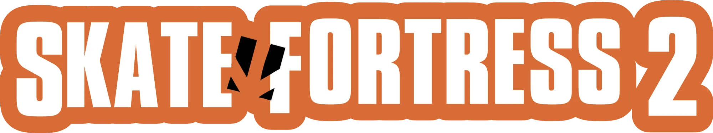

# Skate Fortress 2


Skate 3 skating in Team Fortress 2. Press a key and your TF2 class drops onto a
board. The riding is the real Skate 3 simulation (flick-it tricks, pushing,
grinds, bails), recovered by the [Skate 3 Rust Engine](https://github.com/SK8-ENGINE/skate-3-rust-engine).

## How it fits together

```
 TF2 client ──usercmd──▶ TF2 server (server.so) ──dlopen, in-process──▶ libskate3.so
   ▲  board mesh, Skate cam      │ CTFGameMovement::SkateMove              │ GamePhysics + SkaterRuntime
   └──── networked pose ─────────┘ ◀── origin, body/deck/camera ───────────┘ per player, 60 Hz native
```

This repository is a fork of Valve's Source SDK 2013 (Valve's readme is
[README-source-sdk.md](README-source-sdk.md)) with the Rust engine inside it:

- **`skate-engine/`** is a fork of the Rust engine (GPL-3.0, its own
  [LICENSE](skate-engine/LICENSE)), kept as a git subtree of its `tf2-sidecar` branch;
  `git subtree pull --prefix=skate-engine https://github.com/SK8-ENGINE/skate-3-rust-engine main`
  brings in upstream changes. It adds
  `libskate3.so` (crate `crates/skate3-lib`; code in `crates/skate-game/src/sidecar/`,
  C interface in `ffi.rs`). It runs the engine's own per-tick pipeline without Bevy's
  scheduler or a window, one worker thread per skater:
  - `bsp.rs` rebuilds player-solid collision from a BSP: world brushes plus displacements.
  - `pad.rs` turns TF2 input into a virtual Xbox pad.
  - `protocol.rs` defines the request format. The same requests also work over TCP
    with the `skate3-sidecar` test binary.
- **`src/`** and **`game/mod_tf/`** are the SDK side, on branch `tf2-skate`. It adds `TF_COND_SKATING`:
  - The server loads libskate3.so and steps it from each usercmd: `tf_player_skate.cpp`, `shared/tf/tf_skate_sidecar.cpp`.
  - The client predicts its own skater with a second copy of the simulation (`c_tf_skate_predict.cpp`); see Multiplayer.
  - The client draws Skate 3's own board (`c_tf_skateboard.cpp`, mesh converted from your disc by the in-game setup) and uses the Skate camera rig (`ClientModeTFNormal::OverrideView`).
  - Options > Advanced > Skate 3 holds the setup panel (`tf_skate_setup_dialog.cpp`) and the skate settings.
  - The mouse drives the flick stick (`tf_input_main.cpp`).
- Requests carry Source space (Z-up inches). Only libskate3.so converts
  them to Skate's Y-up metres, using `skate_world_scale` (default 0.0254).

## Setup (Linux)

Building (needs podman; everything builds in Steam's runtime container and
installs into `game/mod_tf/bin/linux64`, so the mod folder is
self-contained). Point `SKATE_BUILD_CACHE` at a roomy disk:

1. **Skate 3 simulation and converter**, `libskate3.so`:
   ```bash
   SKATE_BUILD_CACHE="/big/disk/tf2-skate-build" ./build-skate-lib.sh
   ```
2. **Audio decoder**, `libvgmstream.so` (vgmstream with FFmpeg's EA-XMA decoder):
   ```bash
   SKATE_BUILD_CACHE="/big/disk/tf2-skate-build" ./build-vgmstream.sh
   ```
3. **Mod DLLs**, `client.so` and `server.so`:
   ```bash
   ./build-sdk.sh
   ```
4. **Steam:** install Team Fortress 2 and Source SDK Base 2013 Multiplayer, and keep Steam running.

**Skate 3 data**, from your own Xbox 360 disc, is converted in game. On first
launch the **Skate 3 setup** popup opens (later: Options > Advanced > Skate 3,
or the `skate_setup` console command):
1. Pick the disc image (`.iso`), its `default.xex`, or an extracted disc folder,
   with Source's own file dialog.
2. Press Convert. It takes a few seconds.

Everything it makes goes into the mod folder, about 270 MB, so there is
nothing to configure. The disc you picked is remembered in `cl_skate_setup_source`.

| Path in `mod_tf/` | Contents |
|---|---|
| `skate3_data/assets/` | the simulation's data: animation banks, graphs, tuning database, physics skeletons, trick names |
| `sound/skate/` | the skateboard sounds, decoded with `libvgmstream.so`, and Skate 3's sound-event table |
| `models/skate/`, `materials/models/skate/` | Skate 3's board mesh and textures |

The converter is part of `libskate3.so` (`skate-engine/crates/skate-game/src/sidecar/setup/`)
and reads the ISO in place. No Python or other tools are involved. From a terminal:
```bash
skate-engine/target/release/skate3-sidecar --setup "Skate 3.iso" game/mod_tf
```
Set `SKATE_VGMSTREAM` to `libvgmstream.so`'s path when running it outside the mod folder.

### Testing the first-time setup

`tools/reset-skate-setup.sh` makes the next launch a first run. It moves
everything the setup made into `game/skate-setup-backups/<time>/` (nothing
is deleted). Your sound-picker choices in `sound/skate/events.txt` stay in place.
```bash
tools/reset-skate-setup.sh
```
```bash
./play.sh
```
The popup should open at the main menu. Pick the ISO, press Convert, and wait for "Ready!".
Then start a map (`map koth_brazil`), pick a class and press K. You should get Skate 3's
board, sounds and trick names.

Things worth checking:
- **Cancel:** press "Later" and confirm the popup comes back on the next launch.
- **Bad input:** pick the wrong file and confirm the panel shows an error instead of crashing.
- **Without restarting:** run `skate_setup` in the console to reconvert while in a map.

To put the previous files back:
```bash
tools/reset-skate-setup.sh --restore
```
`--list` shows the saved sets.

## Play

```bash
./play.sh +map ctf_2fort
```

`play.sh` launches the mod in Steam's sniper runtime. Everything the mod runs is in
`game/mod_tf/bin/linux64`: `client.so`, `server.so`, `libskate3.so` and
`libvgmstream.so`. Pick a class and press **K** to start or stop skating. On
a controller, press **BACK** (View).

| Default key | Skate |
|---|---|
| W A S D | left stick: lean and steer, or walk while off the board |
| mouse | right stick: pull back then flick forward to ollie; other flicks do flip tricks |
| shift | A: push |
| mouse2 | B: brake / powerslide |
| space | X |
| mouse1 | Y: step off or back onto the board |
| Q / E | left / right trigger: grabs |
| ctrl / mouse3 | LB / RB |
| alt | left stick click |

The skate controls are separate from TF2's binds. Remap them, keyboard and controller,
in Options > Advanced > Skate 3 > **Skate 3 controls...** (or the `skate_controls` command).
They're saved as `cl_skate_key_*` / `cl_skate_pad_*`. Start/stop skating (K, controller
Back) is under Options > Keyboard > Skate 3.

Settings (most are in Options > Advanced > Skate 3):

| Setting | Effect |
|---|---|
| `cl_skate_mouse_gain`, `cl_skate_mouse_decay` | Your flick-stick feel. Per player: sent to the server, which applies them to your skater only. |
| `skate_difficulty` | Skate 3 physics mode (easy, normal, hardcore, motorized). A server setting: yours when you host, the server's elsewhere. |
| `cl_skate_hud`, `cl_skate_hud_air`, `cl_skate_hud_units` | Trick feed; air time, distance and height plus speed; metric or imperial. |
| `cl_skate_camera`, `cl_skate_camera_smoothing`, `cl_skate_board_yaw`, `cl_skate_board_z` | Camera while skating (1 Skate 3's rig, 2 over the shoulder, 0 third person) and board drawing. |
| `cl_shoulder_camera`, `cl_shoulder_camera_dist`, `_right`, `_up`, `_side`, `_skate_dist`; `shoulder_camera_toggle`, `shoulder_camera_swap` | Over-the-shoulder camera on foot (when the server's `tf_allow_shoulder_camera` is 1, the default) and its placement. The crosshair moves to where shots land. |
| `skate_collide_players`, `skate_collide_teammates`, `skate_ram_speed`, `skate_ram_bail_speed`, `skate_stomp_speed` | Server: skaters knock back and hurt enemies they hit, and kill players they land on. A hard hit makes the skater bail. |
| `skate_board_drop`, `skate_board_lifetime`, `skate_board_hurt_speed`, `skate_board_kill_speed` | Server: a dead skater's board drops as a physics object that can hurt or kill enemies. |
| `skate_hitboxes` | Server: hitboxes follow the skater's pose (default 1). |
| `cl_skate_predict` | Predict your own skater: 0 off, 1 on other people's servers (default), 2 always (to test on your own server). `cl_skate_predict_debug 1` prints its events, `2` every sync check. |
| `skate_world_scale`, `skate_debug` | Server. |

## Making maps

Skate 3 finds grindable edges in the map geometry itself. For a rail, ledge or coping
you want guaranteed to grind, add `skate_rail` nodes:
1. In Hammer, add `game/mod_tf/skate.fgd` as a game data file beside `tf.fgd`.
2. Place `skate_rail` point entities along the rail, at the height the trucks should
   ride (its top edge).
3. Give each node a name and point its **Next Node** at the following one, like
   `path_track`. Leave the last node's empty, or point it back at the first for a
   closed loop.

The server sends the chains to the simulation when the map loads; the console shows
`… N rails` in the `[skate] world` line.

## Multiplayer

The server runs every skater and has the final say. Every client needs the mod
folder, including the converted Skate 3 data, so each player runs setup once.

**Prediction.** On someone else's server, your client also simulates your own
skater from the same usercmds, so it answers your input at once instead of a round
trip later (`c_tf_skate_predict.cpp`). This works because the simulation is
deterministic: the same inputs from the same start give the same result, byte for
byte (`tools/skate_determinism.py` checks this). The client builds the same world
from the map file, spawns the same skater where the server did, and replays every
usercmd since the server's skater started.

- The only input the client can't know is a bail the server forces (hitting a
  player, deep water). The server reports those per usercmd. If the client guessed
  differently, it puts its skater back to a confirmed copy and replays the
  commands since. That is a few milliseconds of work, and you won't see it.
- The confirmed copy is checked against the server's position at every
  acknowledged usercmd. If they ever differ, the client stops predicting and draws
  the server's skater until you next start skating. It says so in the console.
- Changing the flick-stick sliders mid-ride, or a server that drops usercmds, can
  cause that. Windows and Linux builds simulate identically (the library carries its own
  maths functions, `det_math.rs`), so mixed games predict too.

- **On one PC:** start a listen server (`./play.sh +map koth_brazil +maxplayers 8`),
  add bots (`tf_bot_add 3`), then run `skate_bots 1`, so you see remote
  skaters: interpolation, retargeted animation, board and sounds. `skate_bots 0`
  stops them.

  Skating bots drive themselves (`tf_bot_skate.cpp`):
  - They follow nav mesh routes priced for a board: no ladders, jump or crouch areas,
    climbs taller than a curb, stairs going up, or the enemy's spawn room.
  - They steer for a point ahead on the route, push, brake into corners, and steer away
    from walls.
  - They ollie curbs and do flip tricks and grabs on clear straights.
  - A stuck bot hops off and back on, facing its route.

  Cvars:
  - `skate_bot_debug 1` (needs `sv_cheats 1`) draws the routes and wall feelers.
  - `skate_bot_tricks 0` stops tricks, and `skate_bot_speed` sets their cruising speed.
  - `skate_bot_drive 0` passes their normal TF AI movement straight to the board.
- **Two PCs on a LAN:** host with `./play.sh +map koth_brazil +sv_lan 1`. On the
  second PC, run the console command `connect <host ip>`. Both players press K.
- **Lag:** `net_fakelag 100` and `net_fakeloss 2` on a client show how remote
  skaters hold up.
- **Prediction on one PC:** `cl_skate_predict 2`, `cl_skate_predict_debug 1` and
  `net_fakelag 150`, then skate. The console shows the predictor start and any
  rewinds. With `cl_skate_predict 0` the same lag makes the board answer late.

## Windows build

Everything but the game DLLs cross-compiles on Linux (podman, MinGW-w64):

```bash
./build-skate-lib-windows.sh          # skate3.dll      -> game/mod_tf/bin/x64
./build-vgmstream.sh --windows        # libvgmstream.dll
```

`client.dll` and `server.dll` need Visual Studio 2022, so the SDK fork builds them on
GitHub Actions (`.github/workflows/windows-build.yml`, on every push). Fetch them
into `bin/x64` with `gh run download --repo Naitrate/SkateFortress2 -n mod_tf-win64 -D
game/mod_tf/bin` (the artifact holds `x64/`), then package:

```bash
tools/package-mod.sh windows          # tf2-skate-windows.zip (or: linux)
```

The zip holds `mod_tf/` without any Skate 3 data; players run the in-game setup.
`tools/skate_replay.c` plays one ride through either library and records every
step; compare a Windows run (under Wine) with a Linux one byte for byte.

## Testing without TF2

```bash
SKATE3_ASSET_ROOT=… steam-run python3 tools/skate_determinism.py ".../maps/koth_brazil.bsp" --lib game/mod_tf/bin/linux64/libskate3.so
```

This checks what prediction relies on. It runs one skater through the same
inputs several times and compares every step: in a second instance, beside
other skaters, from a copy made partway through, and after rewinds.

```bash
SKATE3_ASSET_ROOT=… steam-run python3 tools/sidecar_smoke.py ".../maps/koth_brazil.bsp" --lib game/mod_tf/bin/linux64/libskate3.so
```

Without `--lib`, it connects to a running `skate3-sidecar` test server over TCP.

This spawns a skater at the map's player start, pushes, ollies, and prints the
state, position and camera.

## Status and known gaps

- **Working, verified headless:** BSP collision extraction (test_hardware: 64k triangles, 3.7k brushes, 525 displacements), spawning at the player's position and yaw, pushing, ollies, air and landing, wipeouts, and the Skate camera.
- **Momentum carries over, verified headless.** Start skating mid-air (say mid rocket jump) and the skater
  keeps the player's velocity and lands on the board. Rockets, airblast and other knockback push a
  skater too: the server hands them to the simulation, and the predicting client rewinds when one
  arrives. Not yet tried in game.
- **Prediction is new and untested in game.** Without it, or after it loses sync, your own skater lags by about one round trip.
- **AEMS sounds** (`.abk` banks: concrete grinds, board scrapes, wheel skids, foot and tail drags, body slides) are extracted but not mapped to events yet. See `docs/skate3-audio-re.md`.
- **Rails need `skate_rail` entities.** Otherwise grinds work only on edges Skate classifies itself; stock TF2 maps have no rail splines.
- **Static world only.** Doors and moving brushes are ignored; static `func_brush`es count as they're placed in the map. All surfaces use one material.
- **Windows build is new.** skate3.dll and libvgmstream.dll cross-compile and run (tested under Wine); client.dll/server.dll build on GitHub Actions and haven't been tried in the game on Windows yet.
- **Licensing.** The engine is GPL-3.0-only and the SDK is under Valve's Source 1 SDK license. Don't distribute builds until that's sorted out.
